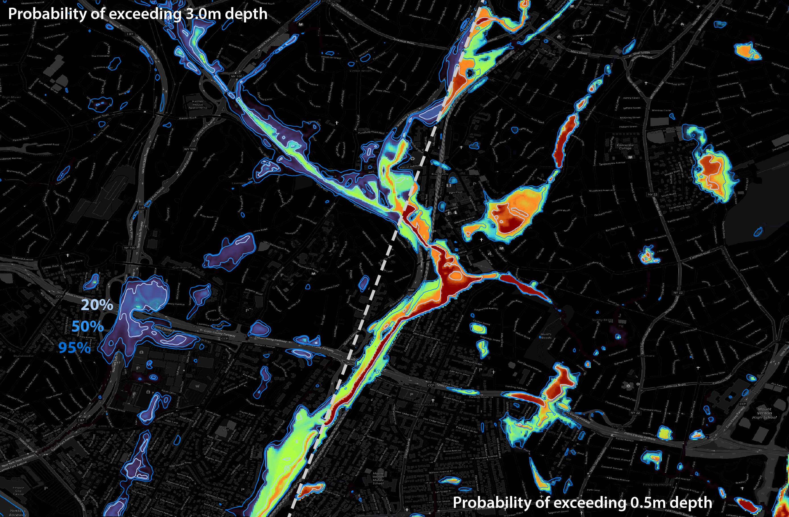
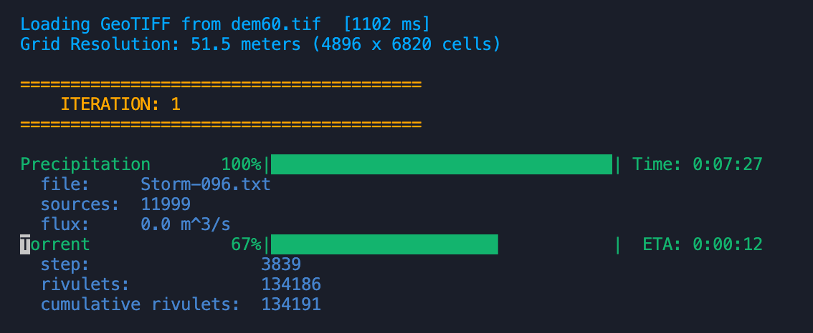

Probabilistic ensemble generation with Torrent.

# What's New??

- ***Export of Velocity Fields***, May 13, 2025
  - Estimates of the velocity-field (including both components and magnitude) can now be saved along with the depth snapshots using the `save-velocity-fields` flag in the configuration file.

- ***Dam Breach Simulations***, April 23, 2025
  - Added the ability to internally generate hydrographs corresponding to dam breaches directly within Torrent.
  - Previously, this capability could be partially realized by externally generating a hydrograph and incoporating it as an NWM-style source.
  - This required an external means of generating a deterministic hydrograph and couldn't readily caputure uncertainty in the breach conditions.
  - Many of the parameters of a dam breach within Torrent can now either be set deterministically or stochastically, with support for both uniform and normal distributions. By setting `num-realizations` > 1 in the configuration file, a stochastic ensemble of simulation results will be automatically be generated that reflects the uncertainty in the breach conditions.


# Introduction

## What is Torrent?

Torrent is a computationally efficient, fully two-dimensional model of overland flooding. The Lagrangian rivulet based approximation used in Torrent is described in detail in [Extremely rapid, Lagrangian modeling of 2D flooding: A rivulet-based approach](https://www.sciencedirect.com/science/article/pii/S1364815223000166).

The efficiency of the approach stems from three simplifying assumptions relative to traditional Lagrangian methods:
- Each infinitesimal Lagrangian fluid parcel is abstracted into a parcel with finite length ⎯ a rivulet;
- A single, scalar depth grid is used to mediate interactions between rivulets; and
- Individual rivulet dynamics are reduced to local, slope-driven forcing, neglecting the effects of both momentum and shear.

This approach can be 4 to 6 *orders of magnitude* more computationally efficient than the traditional solution of the shallow water equations. Simulations that might take tens of hours to run when massively parallelized on an HPC platform can now often be run in seconds to minutes on a laptop.


## Capability Highlights

This leap forward in computational efficiency makes it possible to contemplate:
- Simulations with far greater breadth. We've simulated monsoon season flooding over the entire Indian subcontinent, for example, at 90m resolution.
- Much higher resolution simulations, down to 1m or 3m cells.
- The performance of nested simulations where lower fidelity simulations run over a wide area are used to set the boundary conditions for high resolution inset simulations.
- The generation of large ensembles to support uncertainty quantification and probabilistic forecasts.
- The integration of contaminant transport (still in alpha level development).


## What Inputs Does Torrent Require?

Torrent two inputs with a third optional input:

- A *Digital Elevation Model* (DEM) that describes the relevant topography;
- A description of spatiotemporal *source(s) of fluid flux* (multiple types of spatiotemporal boundary conditions are supported); and
- An optional spatial representation of the *manning coefficient* (a single, homogeneous value for the entire region can be used as well).


## What Outputs Does Torrent Provide?

Torrent provides a number of outputs that can be useful in characterizing or visualizing different aspects of flood or simulation dynamics. These include:

- Periodic snapshots of flow depth along with the maximum depth observed in each cell. Filename patterns: `depth-n-t.tif` and `peak-depth-n.tif`, where `n` is the realization and `t` the simulation step;
- Periodic snapshots the estimated flow velocity can also be exported. The vector components have filename pattern `ux-n-t.tif` and `uy-n-t.tif`, while the overall velocity magnitude filenames follow `u-n-t.tif`;
- Time traces of the current and cumulative rivulet numbers and associated volumes as well as a time trace of the flux. Filename pattern: `flux-n.csv`;
- Periodic and peak characterizations of contaminant levels (if a contaminated area has been specified). Filename patterns: `contamination-n-t.tif`, `concentration-n-t.tif`, and `peak-contamination-n.tif`. [optional];
- The geospatial distributions of the stochastically generated flux sources for each flux period . Filename pattern: [base precip filename]`-source-lat-longs-i.csv` [optional]; and
- Temporal tracks of selected rivulets for the purpose of analysis or visualization. Filename pattern: `rivulet-tracks-n.csv` [optional].

Where `n` is the iteration, `t` is the simulation step, and `i` is the precipitation distribution. Finally, Torrent outputs a file that captures:

- Timing information for each simulation run, including a copy of the configuration data used so that the simulation can be duplicated in the future. Filename pattern: `timing-for-n-[date stamp].json`.


## Use

To use Torrent you will first need to add it to your Julia environment. To do this, start a **Julia REPL**, press the right-bracket key, ']', to bring up the package manager, and enter:

```julia
add https://github.com/DOE-ICoM/Torrent.jl.git
```

If you run into an access error, you may need to, first, ensure that you have your GitHub account setup so that it can be accessed via SSH and, second, ensure that Julia knows to use the CLI version of SSH. Once you've opened the REPL, but before switching to the package manager, you may need to enter:

```julia
ENV["JULIA_PKG_USE_CLI_GIT"] = true
```

Once this is working, the `add` command should pull the Torrent package into your local environment. (Note, that if you later want to update to a newer version of Torrent, just go back to the package manager and 'update Torrent'.) You should now be able to import the Torrent package into your julia code. The main entry point is the `torrent` function. It takes only a single parameter, the name of a JSON-based configuration file.

```julia
# my_main_file.jl

import Torrent

filename = "/path/to/configuration_file.json"

torrent(filename)
```

Torrent is **multithreaded**. In order to make use of this feature, though, we need to let Julia know to launch multiple threads at run time. If running from the command line, julia can be launched, for example, with 8 threads using:

```julia
julia --threads 8 my_main_file.jl
```

If you're using VS Code, before running Torrent open the Settings (`Cmd ,`), search for `julia threads`, and set the corresponding value to the number of cores you have (or would like to use). Note that Julia does seem to have a bug related to threading. We have had trouble before if this number is set too high where Torrent will simply hang in the middle of a run, with no further progress and no CPU load. If this happens, you might try reducing the number of threads it's launched with. This often solves the problem.

The `torrent` function provides progress information during execution. Note that the ETA information can be particularly unreliable, especially during the simulation as the computation time depends on the number of rivulets, which can vary dramatically over the course of a run. A sample screenshot is shown below:



The structure of the configuration file is described in the following section. 


# Torrent Configuration

## Overall Configuration File Format

Torrent is configured using a JSON-based configuration file. An overview of the format is shown below, including all optional sections. 

```json
{
  "rivulet-thickness": [Float],
  "rivulet-length": [Int],

  "time-step-seconds": [Float],
  "max-steps": [Int],
  "save-every-steps": [Int],
  "compute-max-every-steps": [Int],
  "output-directory": [String],
  "exclude-no-data-cells": [Bool],
  "num-realizations": [Int],
  "interpolate-output": [Bool],
  "save-velocity-fields": [Bool],
  "smooth-velocity-fields-by": [Float],

  "dem": {
    "filename": [String],
    "units": [String]
  },

  "num-sources": [Int],
  "write-precipitation-distributions": [Bool],

  "rain-time-series": {
    "filename-pattern": [String],
    "min-index": [Int],
    "max-index": [Int],
    "file-interval-seconds": [Float]
  },

  "rain-multiband-geotiff": {
    "filename": [String],
    "min-index": [Int],
    "max-index": [Int],
    "band-interval-seconds": [Float]
  },

  "rain-nwm": {
    "filename": [String],
    "flux-interval-seconds": [Float]
  },

  "boundary-conditions-time-series": {
    "dem": {
      "filename": [String],
      "units": [String]
    },
    "filename-pattern": [String],
    "min-index": [Int],
    "max-index": [Int],
    "index-step": [Int],
    "index-offset": [Int],
    "seconds-per-step": [Float],
    "inset-from-border": [Int]
  },

  "dam-failure": {
    "latitude": [Float],
    "longitude": [Float],
    "breach-width-top": [Distribution],
    "breach-width-bottom": [Distribution],
    "reservoir-volume-initial": [Distribution],
    "reservoir-depth-curve": [String | Float | Array],
    "dam-height-initial": [Distribution],
    "dam-height-final": [Distribution],
    "failure-period": [Distribution]
  },

  "manning-coef": [Float | String],

  "contaminated-area": {
    "ll-latitude": [Float],
    "ll-longitude": [Float],
    "ur-latitude": [Float],
    "ur-longitude": [Float],
    "start-step": [Int],
    "end-step": [Int],
    "contamination-rate": [Float]
  },

  "rivulet-tracking": {
    "num-rivulets": [Int],
    "only-contaminated": [Bool],
    "track-every-time-steps": [Int]
  }
}
```

Each of the configuration options are described in detail in the following sections.

## Rivulet Characteristics

Rivulets are characterized by two user-adjustable parameters: their thickness, `rivulet-thickness`, and length, `rivulet-length`.

- `rivulet-thickness` is the thickness of a rivulet in meters. High fidelity simulations might use values as small as 0.01 meters, while coarser initial explorations might use values as large as 0.5 meters. [`Float`]

- `rivulet-length` should be provided in grid cells. To get the absolute length of a rivulet, one would then need to multiply by the width of a DEM grid cell. Rivulets can often be kilometers long. [`Int`]

All rivulets have the same length and thickness at this point.


## Simulation Parameters

There are a number of parameters that define various aspects of the simulation to be run:

- `time-step-seconds`, as the name implies, is the duration of a time step in seconds. Both the simulation outcome and computational efficiency should be relatively insensitive to this within some bounds. Set it too big or too small, though, and things can go a bit haywire. Sixty seconds is usually quite reasonable. [`Float`]

- `max-steps` is the duration of a simulation realization in steps. For example, if a one hour simulation was desired and each time step was sixty seconds, then you would set `max-steps` to 60. A 24 hour simulation would be 1,440 steps. Longer simulations might be thousands or even tens of thousands of steps. [`Int`]

- `save-every-steps` specifies how frequently, in time steps, to output a snapshot of the current depth (and potentially contamination) grids. Note that for bigger grids the save time (and disk space) can be significant if snapshots are saved frequently. [`Int`]

- `compute-max-every-steps` denotes how frequently to recompute the peak depth. Computing the max depth observed for each grid can actually be quite computationally intensive (particularly for large grids where you may have hundreds of millions or billions of grid cells). Computing the max at every time step would be achieved by setting the value to 1. The actual dynamics of the physical systems being simulated tend to evolve over time scales of hours rather than minutes, however. We typically get satisfactory results recomputing the max every 3-6 simulation hours. Assuming a time step of 1 minute, this would mean a `compute-max-every-steps` value of 180 or 360. [`Int`]

- `output-directory` indicates where to store the output files. All output files have automatically generated filenames, so only the directory need be specified. Note that files are overwritten without warning. [`String`]

- `exclude-no-data-cells` flags whether or not to treat cells with the no data value as boundary cells, essentially terminating the rivulet when such a cell is reached. This can speed things up, for example, when running a coastal simulation if you set the no data value to 0 in the DEM raster and enable this flag. This would prevent the simulation from continuing out over the ocean. It does, however, mean rivulets will be terminated when they reach sea level, which can change the apparent flood dynamics a significant difference inland. Just beware. [`Bool`]

- `num-realizations` determines how many realizations to automatically run using the same rivulet and simulation parameters. Since Torrent is stochastic, running multiple realizations to generate an ensemble of results can help quantify some aspects of model uncertainty. The output filenames include the realization number to prevent overwriting the output from prior realizations. Note that the set of flux sources are reloaded for every realization and new source distributions randomly generated for each. [`Int`]

- `interpolate_output` selects whether the resulting flood depth and contamination files are interpolated onto a grid based at cell centers rather than edges. This results in output grids with one less row and column than the input DEM. It can be useful when comparing results to those of other overland flood models.

- `save-velocity-fields` selects whether velocity field information should optionally be saved along with depth snapshots. The estimated direction of the local velocity field is determined by the direction of the steepest gradient of decent of the surface water elevation. The magnitude of the velocity is estimated using Manning's formula. The two velocity components, $u_x$ and $u_y$, are written out in separate rasters with filenames beginning with '**ux-**' and '**uy-**'. The scalar magnitude, $|u|$, is written in a file beginning with '**u-**'. Note that the rivulet thickness essentially quantizes the depth field and results in semi-quantized velocity fields and values as well. As such, to aid in visualization it's possible to smooth the velocity fields before they're saved. The amount of smoothing can be set with the `smooth-velocity-fields-by` parameter in the config file (in units of cells). By default it's set to 1.5 cells. If the value is set to 0.0 no smoothing is applied.

## Digital Elevation Model

Each simulation takes place in the context of the topography defined by a digital elevation model (DEM). A DEM is described as a simple object with two fields:

```json
  "dem": {
    "filename": [String],
    "units": [String]
  }
```

- `filename` specifies the raster file to load the DEM from. Both GeoTIFFs (with extension `tif`, `tiff`, or `geotiff`) and ESRI ASCII grid files (with extension `asc` or `txt`) are supported. [`String`]

- `units` indicates whether the georegistration of the raster file is in `"degrees"` or `"meters"`. The type of units (along with, potentially, the latitude) is internally used to compute the breadth of a grid cell in meters. Raster cells are assumed to have the same horizontal and vertical dimension. The computed grid cell size is printed at the beginning of a run. [`String`]


## Source Flux Characterization

The other primary ingredient of a Torrent simulation is one or more spatiotemporal definitions of source flux(es). Two options apply to all flux definitions.

- `num-sources` is the number of source locations that will be stochastically generated for each spatial distribution of flux. This number of source locations will be generated for each time slice for which a flux is specified. For more information on how spatiotemporal distributions of flux are specified in the rivulet approach, please see the full [manuscript](https://www.sciencedirect.com/science/article/pii/S1364815223000166). [`Int`]

- `write-precipitation-distributions` causes the set of source locations for each flux period to be written to disk in CSV format. [`Bool`]

Flux sources are then specified using one or more of the following JSON objects. At least one flux source must be specified. Multiple sources can be used in conjunction. For example, you might want to use a `boundary-conditions-time-series` along with a `rain-time-series` to perform a nested simulation.


### Raster Time Series of Precipitation (File Series)

Source water for a simulation can come in the form of spatiotemporal distributions of precipitation. These distributions can be quantified by a series of raster files, one corresponding to each temporal period (the periods are assumed to be of uniform duration). Precipitation fluxes are expected to be in units of mm/Hr.

```json
  "rain-time-series": {
    "filename-pattern": [String],
    "min-index": [Int],
    "max-index": [Int],
    "file-interval-seconds": [Float]
  }
```

- `filename-pattern` is a printf-style string pattern defining the file series to be read, e.g., `/path/to/storm/rain-%03d.tif`. A single integer value will be passed to the file pattern. The files are assumed to be sequentially numbered at this point (1, 2, 3, ...). [`String`]
- `min-index` provides the starting index to use. [`Int`]
- `max-index` provides the final index to read. [`Int`]
- `file-interval-seconds` defines the period of time that each distribution represents. If each file is an hourly snapshot of precipitation, for example, the value would be 3,600. [`Float`]


### Raster Time Series of Precipitation (Multi-band GeoTIFF)

Alternatively, precipitation distributions may be encapsulated in a single, multiband GeoTIFF, with each band representing a snapshot of the precipitation distribution. Precipitation fluxes are expected to be in units of mm/Hr.

```json
  "rain-multiband-geotiff": {
    "filename": [String],
    "min-index": [Int],
    "max-index": [Int],
    "band-interval-seconds": [Float]
  }
```

- `filename` name of the multiband GeoTIFF that contains the distributions. [`String`]
- `min-index` provides the starting band index to use. [`Int`]
- `max-index` provides the final band index to use. [`Int`]
- `band-interval-seconds` defines the period of time that each distribution represents. If each band is an hourly snapshot of precipitation, for example, the value would be 3,600. [`Float`]

### Point Source Fluxes

Torrent also has an ability to utilize point source data as might be gleaned, for example, from the National Water Model output or use cases where hydrographs may be defined at one or a limited number of locations. These hydrographs may be supplied in the form of a CSV file. The first column should denote the Y-location of the source (e.g. latitude), the second column the X-location of the source (e.g. longitude). The remaining columns in each row, the third and beyond, should then represent a time series of the lateral influx of    precipitation at that location in m^3/s. The CSV file should not contain a header row. The configuration elements required for this type of source boundary condition are:

```json
  "rain-nwm": {
    "filename": [String],
    "flux-interval-seconds": [Float]
  }
```

- `filename` specifies the name of the CSV file in the format described above. [`String`]
- `flux-interval-seconds` is the number of seconds in the period that each column represents. For example, if the flux values are reported hourly, the value would be 3,600. [`Float`]

### Depth Grid Series as Boundary Conditions (File Series)

Fluxes may be described implicitly by a series of depth forecasts from a prior simulation. This allows one to setup nested simulations where, for example, the results from a low-resolution, wide-area forecast can serve as the boundary condition for a smaller, nested, much higher-resolution simulation. To determine the flux at the boundary, Manning's equation is used along with the local flow depth and water surface elevation slope to estimate the velocity. The component of the velocity perpendicular to the boundary is used to set the flux.

```json
  "boundary-conditions-time-series": {
    "dem": {
      "filename": [String],
      "units": [String]
    },
    "filename-pattern": [String],
    "min-index": [Int],
    "max-index": [Int],
    "index-step": [Int],
    "index-offset": [Int],
    "seconds-per-step": [Float],
    "inset-from-border": [Int]
  }
```

- `dem`: This denotes the DEM that was used in the prior simulation to which the depth grids referenced below correspond (that is the *outer* DEM domain). Please see notes in the digital elevation model section above for details.
- `filename-pattern` is a printf-style string pattern defining the series of depth files to be used as boundary conditions, e.g., `/path/to/depth/fields/depth-1-%d.tif`. A single integer value will be passed to the file pattern. [`String`]
- `min-index`: The starting index of the depth raster to use. [`Int`]
- `max-index`: The last index of the depth raster to use. [`Int`]
- `index-step`: Depth files need not be sequentially numbered. Depth rasters might, for example, have been written out every 60 or 120 time steps. That number would go here. [`Int`]
- `index-offset`: The index number is used to compute when within the current simulation the flux boundary condition from the prior simulation is applicable. You might, however, want to start a simulation at a time corresponding to something other than the start time of the prior simulation. `index-offset` can be used to manage this case. For example, if you wanted to start this simulation at what would correspond to step 1,440 of the prior simulation, you could set both `min-index` and `index-offset` to 1,440. [`Int`]
- `seconds-per-step` denotes the number of seconds per time step in the prior simulation. [`Float`]
- `inset-from-border`: When a rivulet hits a border in the a Torrent simulation it is marked for eventual removal from the simulation and the position of the rivulet's head location stops evolving. As such, we don't want to create new rivulets representing the influx of material directly on the border. In fact, even if the local surface slope is generally away from the border, the local influx of material can push water back upstream and out of the domain. The boundary flux should, therefore, be seeded a few cells into the nested simulation domain. The units are grid cells of the *inner* DEM domain. A value of 10 may be a reasonable place to start. [`Int`]

### Dam Failure

Dam failures or breaches may also be simulated with Torrent (and integrated with other potential sources of flux). The location of a breach is specified by its `latitude` and `longitude` with each in the same units as the DEM registration. A breach is assumed to be trapazoidal in shape with the user able to independently specify top, `breach-width-top`, and bottom, `breach-width-bottom`, widths of a breach. Breach widths should be specified in meters and the top must be wider than the bottom.

The breach is assumed to occur gradually over a duration, `failure-period`, given in seconds. During this failure period the effective height of the dam within the breach is reduced linearly from `dam-height-initial` to `dam-height-final` (both in meters). Currently the failure is initiated at the start of the simulation and after the `failure-period` the dam height is assumed to remain constant at `dam-height-final`.

```json
"dam-failure": {
    "latitude": [Float],
    "longitude": [Float],
    "breach-width-top": [Distribution],
    "breach-width-bottom": [Distribution],
    "reservoir-volume-initial": [Distribution],
    "reservoir-depth-curve": [String | Float | Array],
    "dam-height-initial": [Distribution],
    "dam-height-final": [Distribution],
    "failure-period": [Distribution]
  }
```

Many of the parameters may be characterized by a distribution. In the configuration file this should take the form of either a single float value or  an object. If a single float value is provided, it is assumed that that parameter value is deterministic. If an object is provided, the value of the associated parameter is generated stochastically. The object must contain either `mean` and `std` elements (in which case a normal distribution is assumed), e.g.:
```json
{"mean": [Float], "std": [Float]}
```
or `upper` and `lower` bounds (in which case a uniform distribution is assumed), e.g.:
```json
{"lower": [Float], "upper": [Float]}
```

Finally, to simulate a breach an initial reservoir volume, `reservoir-volume-initial` (in cubic meters), and a depth/volume curve are needed. The initial volume can either be specified as a deterministic value or a distribution. The reservoir depth/volume curve, `reservoir-depth-curve`, can be specified in one of three ways:
- `Float64`: If a floating point value is provided it is assumed that it represents the surface area (in square meters) of a reservoir with a simple rectangular bathymetry.
- `Array`: Alternatively, a depth/volume curve can be approximated by an array of points, with each point represented by a `[volume, depth]` pair. For a given volume (cubic meters), the depth (meters) will be linearly interpolated between known points.
- `String`: Finally, a filename can be supplied where a series of `[volume, depth]` locations is provided as the first two columns of a CSV file (it is assumed that there is no header row). Here, again, the volume is assumed to be in cubic meters and the depth in meters.


## Manning Coefficient

[Manning's formula](https://en.wikipedia.org/wiki/Manning_formula) is used to approximate velocities in Torrent. Manning's coefficient relates to the apparent roughness of the terrain over which the flood waters are moving.

```json
"manning-coef": [Float] or [String]
```

- `manning-coef` can be provided as either a `Float` or a `String` value. In the former case, Manning's coefficient is assumed to be homogeneous across the simulation domain. In the latter case, the `String` is taken to be the filename of a raster grid, the first band of which represents the potentially spatially varying value of the Manning coefficient. Any grid representing the manning coefficient should be in the same projection as the DEM.

## Contamination [ALPHA]

A rudimentary, largely untested, and not yet validated capability to do contaminant tracing is included in Torrent. The feature can be useful in tracking flow movements and debugging simulations. A contaminated area is specified by a rectangular bounding box. Rivulets whose head moves through this region are contaminated at a rate `contamination-rate`. The entire rivulet is assumed to be uniformly contaminated. Only a single, rectangular contamination area can currently be specified.

```json
"contaminated-area": {
  "ll-latitude": [Float],
  "ll-longitude": [Float],
  "ur-latitude": [Float],
  "ur-longitude": [Float],
  "start-step": [Int],
  "end-step": [Int],
  "contamination-rate": [Float]
}
```

- `ll-latitude`: The Y-position of the lower-left corner of the contaminated area.
- `ll-lontiude`: The X-position of the lower-left corner of the contaminated area.
- `ur-latitude`: The Y-position of the upper-right corner of the contaminated area.
- `ur-lontiude`: The X-position of the upper-right corner of the contaminated area.
- `start-step`: The first time step at which the contamination area is activate.
- `end-step`: The last time step the contamination area is active.
- `contamination-rate`: The rate at which the contaminant is transferred to rivulets.


## Rivulet Tracking

Individual rivulets may also be tracked for analytical, debugging, or visualization purposes. This capability can be applied along with the definition of a contaminated area to constrain where (and when) tracked rivulets originate. Rivulet tracks are written out upon simulation completion in a CSV-format file as triplets of columns. For each column triplet, the first column will hold the X position, the second column the Y position, and the third column the time step at which the rivulet was at that position. X and Y positions are in the same units and georegistration as the DEM.

```json
"rivulet-tracking": {
  "num-rivulets": [Int],
  "only-contaminated": [Bool],
  "track-every-time-steps": [Int]
}
```

- `num-rivulets` specifies the number of rivulets to track. Note that because of the way tracking is done internally, there is currently a search function that scales linearly with `num-rivulets`. This search is done for every simulation step. Too many tracks could start to impede algorithm performance. Tracking just a half-dozen rivulets is often sufficient for many needs. [`Int`]
- `only-contaminated` constrains tracked rivulets to be only among those that have been contaminated. Setting this flag along with the specification of a `contaminated-area` provides an easy way to visualize flow at a particular location or time in the simulation. [`Bool`]
- `track-every-time-steps` specifies how frequently to log tracked rivulet positions. A value of 1 would log positions at every time step. A value of 10 will log positions only every tenth time step. Note that a rivulet may make multiple hops within a single time step. [`Int`]

# Disclaimer

This material was prepared as an account of work sponsored by an agency
of the United States Government.  Neither the United States Government
nor the United States Department of Energy, nor Battelle, nor any of
their employees, nor any jurisdiction or organization that has cooperated
in the development of these materials, makes any warranty, express or
implied, or assumes any legal liability or responsibility for the accuracy,
completeness, or usefulness or any information, apparatus, product, software,
or process disclosed, or represents that its use would not infringe privately
owned rights. Reference herein to any specific commercial product, process,
or service by trade name, trademark, manufacturer, or otherwise does not
necessarily constitute or imply its endorsement, recommendation, or favoring
by the United States Government or any agency thereof, or Battelle Memorial
Institute. The views and opinions of authors expressed herein do not
necessarily state or reflect those of the United States Government or any
agency thereof.
   PACIFIC NORTHWEST NATIONAL LABORATORY
       operated by
   BATTELLE
       for the
   UNITED STATES DEPARTMENT OF ENERGY
        under Contract DE-AC05-76RL01830

